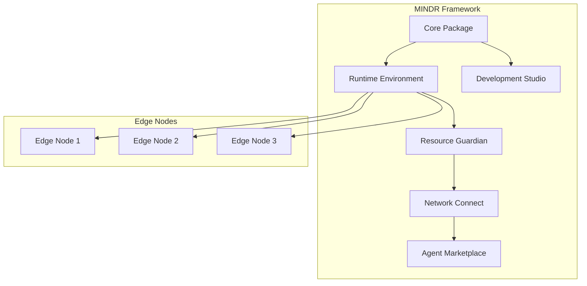
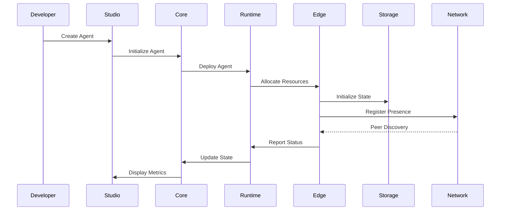
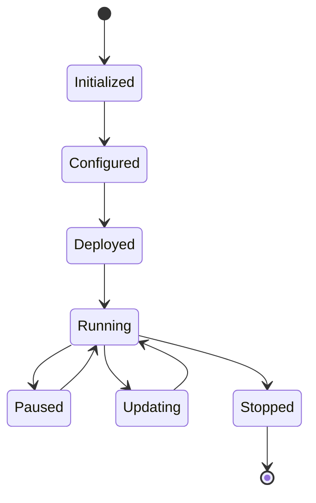

# MINDR

<div align="center">
  
  
  <h3>Edge Intelligence Network</h3>
</div>

[](LICENSE)
[](LICENSE)
[](LICENSE)
[](LICENSE)

## Overview

MINDR is a decentralized edge agent development and deployment framework that enables developers to create persistent AI agents running on distributed network nodes. Built with modern technologies and best practices, MINDR provides a robust foundation for building the next generation of intelligent applications.

## ✨ Key Features

- 🤖 **Intelligent Agents**
  - Advanced AI capabilities integration
  - Natural language processing
  - Machine learning model support
  - Custom behavior programming

- 🌐 **Edge Computing**
  - Distributed node deployment
  - Edge-native architecture
  - Low-latency processing
  - Offline operation support

- 🔄 **State Management**
  - Persistent memory storage
  - State synchronization
  - Transaction management
  - Backup and recovery

- 🔒 **Resource Control**
  - Dynamic resource allocation
  - Usage monitoring
  - Performance optimization
  - Security enforcement

- 🛠️ **Developer Tools**
  - Interactive CLI
  - Visual development studio
  - Debugging utilities
  - Performance profiling

## 🏗️ Architecture



## 🧩 Core Components

### 📦 Core Package (`@mindr/core`)
- Agent lifecycle management
- State and memory interfaces
- Event system
- Plugin architecture
- Error handling
- Logging system

### 🚀 Runtime Environment (`@mindr/runtime`)
- Container orchestration
- Resource allocation
- Performance monitoring
- State persistence
- Load balancing
- Health checks

### 💻 Development Studio (`@mindr/studio`)
- Visual development interface
- Real-time monitoring
- Debugging tools
- Performance analytics
- Code generation
- Template management

### 🛡️ Resource Guardian (`@mindr/guardian`)
- Resource monitoring
- Security enforcement
- Policy management
- Access control
- Threat detection
- Audit logging

### 🔌 Network Connect (`@mindr/connect`)
- P2P networking
- Service discovery
- Data synchronization
- Message routing
- Protocol handling
- Connection management

### 🏪 Agent Marketplace (`@mindr/marketplace`)
- Agent discovery
- Distribution system
- Version management
- Reputation system
- Payment integration
- License management

## 📊 Data Flow



## 🔄 Agent Lifecycle



## 🎮 Resource Management

```typescript
interface ResourceLimits {
  memory: number;    // Memory limit in bytes
  cpu: number;       // CPU cores (1 = 100%)
  storage: number;   // Storage limit in bytes
  network: {
    inbound: number;  // Inbound bandwidth limit
    outbound: number; // Outbound bandwidth limit
  };
  gpu?: {
    memory: number;   // GPU memory limit
    compute: number;  // Compute units
  };
}
```

## 🚀 Getting Started

### 📥 Installation

```bash
# Install MINDR CLI globally
npm install -g @mindr/cli

# Create a new agent project
mindr create my-agent

# Start development
cd my-agent
mindr dev
```

### 🔨 Create Your First Agent

```typescript
import { Agent, AgentConfig } from '@mindr/core';

interface MyAgentState {
  messageCount: number;
  lastProcessed: Date;
}

class MyAgent extends Agent<MyAgentState> {
  async init(): Promise<void> {
    await super.init();
    this.state = {
      messageCount: 0,
      lastProcessed: new Date()
    };
    console.log('Agent initialized with state!');
  }

  async processMessage(message: string): Promise<string> {
    this.state.messageCount++;
    this.state.lastProcessed = new Date();
    return `Processed message #${this.state.messageCount}: ${message}`;
  }
}
```

### 🚢 Deployment

```bash
# Build the agent
mindr build

# Run tests
mindr test

# Deploy to edge network
mindr deploy --network testnet --replicas 3
```

## 📁 Project Structure

```
mindr/
├── packages/
│   ├── core/           # Core framework functionality
│   ├── runtime/        # Runtime environment
│   ├── studio/         # Development studio
│   ├── guardian/       # Resource management
│   ├── connect/        # Network connectivity
│   └── marketplace/    # Agent marketplace
├── examples/           # Example projects
├── docs/              # Documentation
└── assets/            # Static assets
```

## 🤝 Contributing

We welcome contributions! Please see our [Contributing Guide](CONTRIBUTING.md) for details.

## 📄 License

This project is licensed under the MIT License - see the [LICENSE](LICENSE) file for details.

## 🔗 Links

* [Official Website](https://mind-r.xyz)
* [Twitter](https://x.com/MINDR_AI)
* [GitHub](https://github.com/MINDR-AI/MINDR)

## 🙏 Acknowledgments

- Thanks to all our contributors
- Inspired by various AI frameworks and tools
- Built with modern web technologies

## 💬 Support

If you encounter any issues or have questions, please [open an issue](https://github.com/MINDR-AI/MINDR/issues). 